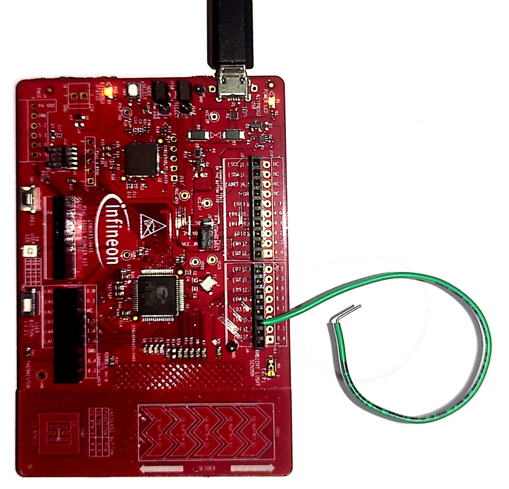
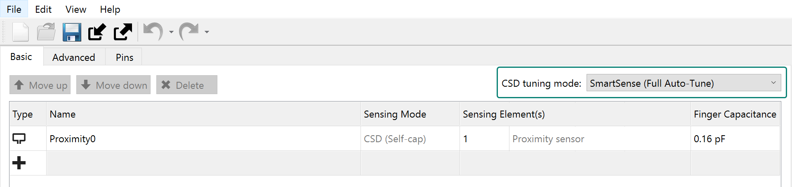
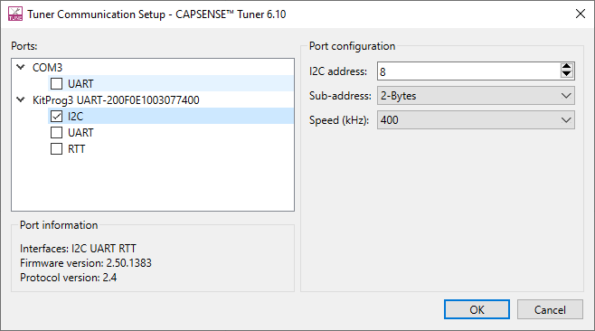
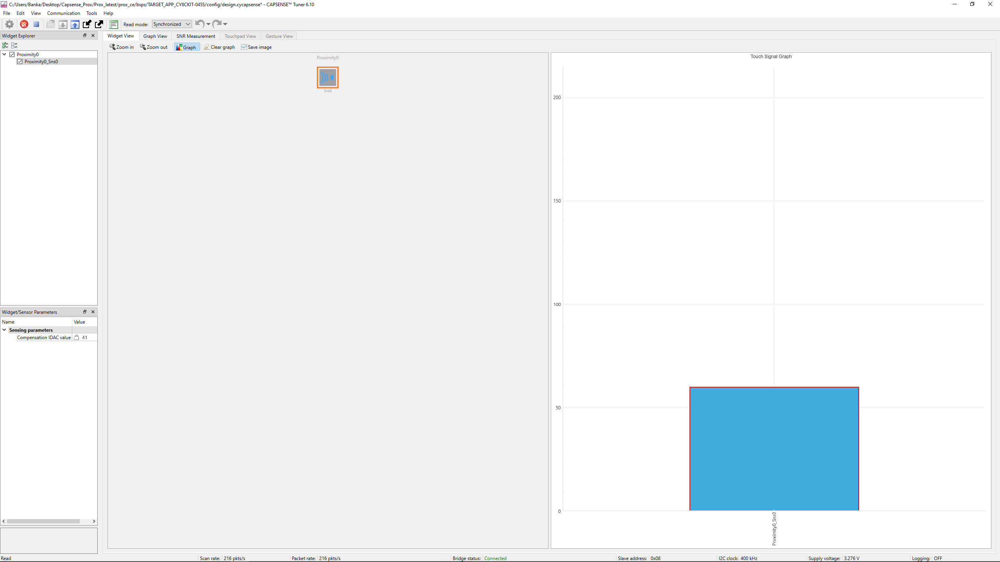
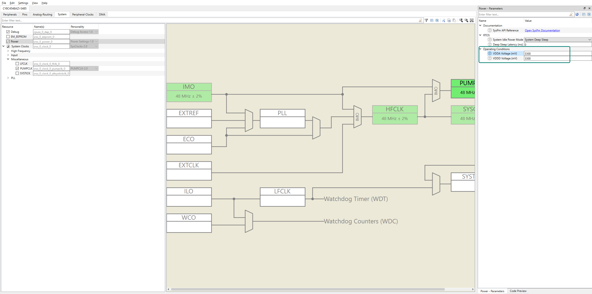

# PSoC&trade; 4: CAPSENSE&trade; proximity sensing

This code example demonstrates a CAPSENSE&trade;-based proximity sensing design to control the brightness of an onboard LED. It helps to learn how to design a proximity sensor using a PSoC&trade; 4 device, and see how an approaching hand controls the intensity of an onboard LED. It employs the CAPSENSE&trade; auto-tuning ability, SmartSense, to tune the proximity sensor for any wire or trace length.

[View this README on GitHub.](https://github.com/Infineon/mtb-example-psoc4-capsense-proximity-tuning)

[Provide feedback on this code example.](https://cypress.co1.qualtrics.com/jfe/form/SV_1NTns53sK2yiljn?Q_EED=eyJVbmlxdWUgRG9jIElkIjoiQ0UyMzg0NzciLCJTcGVjIE51bWJlciI6IjAwMi0zODQ3NyIsIkRvYyBUaXRsZSI6IlBTb0MmdHJhZGU7IDQ6IENBUFNFTlNFJnRyYWRlOyBwcm94aW1pdHkgc2Vuc2luZyIsInJpZCI6ImJhbmthIiwiRG9jIHZlcnNpb24iOiIxLjAuMCIsIkRvYyBMYW5ndWFnZSI6IkVuZ2xpc2giLCJEb2MgRGl2aXNpb24iOiJNQ0QiLCJEb2MgQlUiOiJJQ1ciLCJEb2MgRmFtaWx5IjoiUFNPQyJ9)

## Requirements

- [ModusToolbox&trade;](https://www.infineon.com/modustoolbox) v3.1 or later (tested with v3.1)
- Board support package (BSP) minimum required version: 3.1.0
- Programming language: C
- Associated parts: [PSoC&trade; 4000S, PSoC&trade; 4100S, PSoC&trade; 4100S Plus, and PSoC&trade; 4500S](https://www.infineon.com/cms/en/product/microcontroller/32-bit-psoc-arm-cortex-microcontroller/psoc-4-32-bit-arm-cortex-m0-mcu/)


## Supported toolchains (make variable 'TOOLCHAIN')

- GNU Arm&reg; Embedded Compiler v11.3.1 (`GCC_ARM`) - Default value of `TOOLCHAIN`
- Arm&reg; Compiler v6.16 (`ARM`)
- IAR C/C++ Compiler v9.30.1 (`IAR`)

## Supported kits (make variable 'TARGET')

- [PSoC&trade; 4500S Pioneer Kit](https://www.infineon.com/CY8CKIT-045S) (`CY8CKIT-045S`) - Default value of `TARGET`
- [PSoC&trade; 4100S Plus Prototyping Kit](https://www.infineon.com/CY8CKIT-149) (`CY8CKIT-149`)
- [PSoC&trade; 4000S CAPSENSE&trade; Prototyping Kit](https://www.infineon.com/CY8CKIT-145-40xx) (`CY8CKIT-145-40XX`)
- [PSoC&trade; 4100S CAPSENSE&trade; Pioneer Kit](https://www.infineon.com/CY8CKIT-041-41XX) (`CY8CKIT-041-41XX`) 

## Hardware setup
For a few BSPs, this example requires adding an external proximity wire loop to the kit.
1.	**CY8CKIT-149, CY8CKIT-145-40XX, and CY8CKIT-045S:** Connect a proximity wire loop as shown in Figure 1 to the following respective pins:
   
      | BSP  | Proximity Loop pin |
      | ---- | ------------ |
      | CY8CKIT-045S| P5.5 |
      | CY8CKIT-145-40XX| P2.7 |
      | CY8CKIT-149|	P3.7|


      **Figure 1. Connecting the proximity wire loop to the CY8CKIT-045S kit**
   
      

1.	**CY8CKIT-041-41XX:** This kit has an inbuilt proximity loop equipped so the code example uses the board's default configuration.

## Software setup

See the [ModusToolbox&trade; tools package installation guide](https://www.infineon.com/ModusToolboxInstallguide) for information about installing and configuring the tools package.

Install a terminal emulator if you don't have one. Instructions in this document use [Tera Term](https://ttssh2.osdn.jp/index.html.en).

This example requires no additional software or tools.

## Using the code example

### Create the project

The ModusToolbox&trade; tools package provides the Project Creator as both a GUI tool and a command line tool.

<details><summary><b>Use Project Creator GUI</b></summary>

1. Open the Project Creator GUI tool.

   There are several ways to do this, including launching it from the dashboard or from inside the Eclipse IDE. For more details, see the [Project Creator user guide](https://www.infineon.com/ModusToolboxProjectCreator) (locally available at *{ModusToolbox&trade; install directory}/tools_{version}/project-creator/docs/project-creator.pdf*).

2. On the **Choose Board Support Package (BSP)** page, select a kit supported by this code example. See [Supported kits](#supported-kits-make-variable-target).

   > **Note:** To use this code example for a kit not listed here, you may need to update the source files. If the kit does not have the required resources, the application may not work.

3. On the **Select Application** page:

   a. Select the **Applications(s) Root Path** and the **Target IDE**.

   > **Note:** Depending on how you open the Project Creator tool, these fields may be pre-selected for you.

   b.	Select this code example from the list by enabling its check box.

   > **Note:** You can narrow the list of displayed examples by typing in the filter box.

   c. (Optional) Change the suggested **New Application Name** and **New BSP Name**.

   d. Click **Create** to complete the application creation process.

</details>

<details><summary><b>Use Project Creator CLI</b></summary>

The 'project-creator-cli' tool can be used to create applications from a CLI terminal or from within batch files or shell scripts. This tool is available in the *{ModusToolbox&trade; install directory}/tools_{version}/project-creator/* directory.

Use a CLI terminal to invoke the 'project-creator-cli' tool. On Windows, use the command-line 'modus-shell' program provided in the ModusToolbox&trade; installation instead of a standard Windows command-line application. This shell provides access to all ModusToolbox&trade; tools. You can access it by typing "modus-shell" in the search box in the Windows menu. In Linux and macOS, you can use any terminal application.

The following example clones the "[CAPSENSE&trade; Proximity Tuning](https://github.com/Infineon/mtb-example-psoc4-capsense-proximity-tuning)" application with the desired name "CAPSENSE_Proximity_Tuning" configured for the *CY8CKIT-045S* BSP into the specified working directory, *C:/mtb_projects*:

   ```
   project-creator-cli --board-id CY8CKIT-045S --app-id mtb-example-psoc4-capsense-proximity-tuning --user-app-name CAPSENSE_Proximity_Tuning --target-dir "C:/mtb_projects"
   ```

The 'project-creator-cli' tool has the following arguments:

Argument | Description | Required/optional
---------|-------------|-----------
`--board-id` | Defined in the <id> field of the [BSP](https://github.com/Infineon?q=bsp-manifest&type=&language=&sort=) manifest | Required
`--app-id`   | Defined in the <id> field of the [CE](https://github.com/Infineon?q=ce-manifest&type=&language=&sort=) manifest | Required
`--target-dir`| Specify the directory in which the application is to be created if you prefer not to use the default current working directory | Optional
`--user-app-name`| Specify the name of the application if you prefer to have a name other than the example's default name | Optional

> **Note:** The project-creator-cli tool uses the `git clone` and `make getlibs` commands to fetch the repository and import the required libraries. For details, see the "Project creator tools" section of the [ModusToolbox&trade; tools package user guide](https://www.infineon.com/ModusToolboxUserGuide) (locally available at {ModusToolbox&trade; install directory}/docs_{version}/mtb_user_guide.pdf).

</details>

### Open the project

After the project has been created, you can open it in your preferred development environment.

<details><summary><b>Eclipse IDE</b></summary>

If you opened the Project Creator tool from the included Eclipse IDE, the project will open in Eclipse automatically.

For more details, see the [Eclipse IDE for ModusToolbox&trade; user guide](https://www.infineon.com/MTBEclipseIDEUserGuide) (locally available at *{ModusToolbox&trade; install directory}/docs_{version}/mt_ide_user_guide.pdf*).

</details>


<details><summary><b>Visual Studio (VS) Code</b></summary>

Launch VS Code manually, and then open the generated *{project-name}.code-workspace* file located in the project directory.

For more details, see the [Visual Studio Code for ModusToolbox&trade; user guide](https://www.infineon.com/MTBVSCodeUserGuide) (locally available at *{ModusToolbox&trade; install directory}/docs_{version}/mt_vscode_user_guide.pdf*).

</details>


<details><summary><b>Keil µVision</b></summary>

Double-click the generated *{project-name}.cprj* file to launch the Keil µVision IDE.

For more details, see the [Keil µVision for ModusToolbox&trade; user guide](https://www.infineon.com/MTBuVisionUserGuide) (locally available at *{ModusToolbox&trade; install directory}/docs_{version}/mt_uvision_user_guide.pdf*).

</details>

<details><summary><b>IAR Embedded Workbench</b></summary>

Open IAR Embedded Workbench manually, and create a new project. Then select the generated *{project-name}.ipcf* file located in the project directory.

For more details, see the [IAR Embedded Workbench for ModusToolbox&trade; user guide](https://www.infineon.com/MTBIARUserGuide) (locally available at *{ModusToolbox&trade; install directory}/docs_{version}/mt_iar_user_guide.pdf*).

</details>

<details><summary><b>Command line</b></summary>

If you prefer to use the CLI, open the appropriate terminal, and navigate to the project directory. On Windows, use the command-line 'modus-shell' program; on Linux and macOS, you can use any terminal application. From there, you can run various `make` commands.

For more details, see the [ModusToolbox&trade; tools package user guide](https://www.infineon.com/ModusToolboxUserGuide) (locally available at *{ModusToolbox&trade; install directory}/docs_{version}/mtb_user_guide.pdf*).

</details>

## Operation

1. Ensure that the proximity wire loop is connected as mentioned in the [Hardware setup](#hardware-setup) section, and make sure that in the CAPSENSE&trade; Configurator, the CSD tuning mode is in SmartSense (Full Auto-Tune).

   **Figure 2. CSD tuning mode in CAPSENSE&trade; Configurator**

      


2. Connect the board to your PC using the provided USB cable through the KitProg3 USB connector.

3. Program the board using one of the following:

   <details><summary><b>Using Eclipse IDE</b></summary>

      1. Select the application project in the Project Explorer.

      2. In the **Quick Panel**, scroll down, and click **\<Application Name> Program (KitProg3_MiniProg4)**.
   </details>

   <details><summary><b>In other IDEs</b></summary>

   Follow the instructions in your preferred IDE.
   </details>

   <details><summary><b>Using CLI</b></summary>

     From the terminal, execute the `make program` command to build and program the application using the default toolchain to the default target. The default toolchain is specified in the application's Makefile but you can override this value manually:
      ```
      make program TOOLCHAIN=<toolchain>
      ```

      Example:
      ```
      make program TOOLCHAIN=GCC_ARM
      ```
   </details>


4. After programming, the application starts automatically.

5. Move a hand slowly closer to the proximity sensor present on the board or proximity wire loop connected to the board, and confirm that the LED glows brighter.

6. Now, move a hand slowly away from the proximity sensor present on the board or proximity wire loop connected to the board and observe that the LED gets dimmer.

**Monitor Data Using CAPSENSE&trade; Tuner**

1. Open CAPSENSE&trade; Tuner from the IDE Quick Panel.

2. Ensure that the kit is in KitProg3 mode. For more details on how to update the firmware and switch to KitProg3 mode, see [Firmware-loader](https://github.com/Infineon/Firmware-loader).

3. In the Tuner application, click **Tuner Communication Setup** or select **Tools** > **Tuner Communication Setup**. In the popup window, select the I2C checkbox under KitProg3 and configure as follows: 

            I2C Address: 8
            Sub-address: 2-Bytes
            Speed (kHz): 400

   **Figure 3. I2C Tuner Communication Setup**

      

4. Click **Connect** or select **Communication** > **Connect**.

5. Click **Start** or select **Communication** > **Start**.

6. Under the **Widget View** tab, you can see the proximity widget highlighted in blue color when active. You can also view the sensor data in the **Graph View** tab as shown in Figure 4.

   **Figure 4. Sensor data in Graph View when it is active**

      

7. The CAPSENSE&trade; Tuner can also be used for CAPSENSE&trade; parameter tuning, and measuring signal-to-noise ratio (SNR). 

>**Note:** This code example uses SmartSense and Full Auto-Tune. For Manual tuning the CAPSENSE&trade; Proximity Sensing, see the [ModusToolbox&trade; CAPSENSE&trade; Tuner guide](https://www.infineon.com/dgdl/Infineon-ModusToolbox_CAPSENSE_Tuner_Guide_4-UserManual-v01_00-EN.pdf?fileId=8ac78c8c7d718a49017d99ab0fda31c5) (**Help** > **View Help**) and [AN85951 – PSoC&trade; 4 and PSoC&trade; 6 MCU CAPSENSE&trade; design guide](https://www.infineon.com/AN85951) for more details on selecting the tuning parameters. 


## Debugging

You can debug the example to step through the code.


<details><summary><b>In Eclipse IDE</b></summary>

Use the **\<Application Name> Debug (KitProg3_MiniProg4)** configuration in the **Quick Panel**. For details, see the "Program and debug" section in the [Eclipse IDE for ModusToolbox&trade; user guide](https://www.infineon.com/MTBEclipseIDEUserGuide).

</details>


<details><summary><b>In other IDEs</b></summary>

Follow the instructions in your preferred IDE.
</details>


## Design and implementation

This code example uses a Proximity Sensor or a Proximity Wire Loop and controls the brightness of the onboard LED depends on the depends on the closeness of a hand (object to be sensed) to the proximity sensor. The LED glows brighter as the hand approaches the proximity sensor and glows dimmer as the hand is taken away from the proximity sensor.

The project uses the [CAPSENSE&trade; middleware](https://github.com/Infineon/capsense) (for more details on selecting a middleware, see ModusToolbox&trade; user guide). For more details on CAPSENSE&trade; features and usage, see [AN85951 – PSoC&trade; 4 and PSoC&trade; 6 MCU CAPSENSE&trade; design guide](https://www.infineon.com/AN85951).

The [ModusToolbox&trade; software](https://www.infineon.com/modustoolbox-software) provides a GUI-based tuner application for debugging and tuning the CAPSENSE&trade; system. The *CAPSENSE&trade; tuner* application works with EZI2C and UART communication interfaces. This project has an SCB block configured in EZI2C mode to establish communication with the on-board KitProg, which in turn enables reading the CAPSENSE&trade; raw data by the CAPSENSE&trade; Tuner. The proximity sensor may be tuned using CAPSENSE&trade; tuner. Once tuned, the new parameters may be applied to project. For more details, see [ModusToolbox&trade; CAPSENSE&trade; Tuner guide](https://www.infineon.com/dgdl/Infineon-ModusToolbox_CAPSENSE_Tuner_Guide_4-UserManual-v01_00-EN.pdf?fileId=8ac78c8c7d718a49017d99ab0fda31c5).

## Operation at custom power supply voltages

The application is configured to work with the default operating voltage of the kit.

**Operating voltages supported by the kits**
 |Kit | Supported operating voltages | Default operating voltage|
 |----------------| ---------------------------- | -------------|
 |CY8CKIT-045S          | 5.0 V/1.8 V                | 3.3 V|
 |CY8CKIT-149           | 5.0 V/1.8 V                | 5.0 V|
 |CY8CKIT-145-40XX      | 5.0 V/1.8 V                | 5.0 V|
 |CY8CKIT-041-41XX      | 5.0 V/1.8 V                | 3.3 V|

For kits that support multiple operating voltages, the default BSP configuration is provided by the *design.modus* file should be customized. Do the dollowing to use the example at a custom power supply, such as 3.3 V:
1. Create a directory at the root of the application to hold any custom BSP configuration files. *\<application_folder>/templates*.
2. Create a subdirectory for each target that needs to be modified to work at a custom power supply. *\<application_folder>/templates/TARGET_<BSP-NAME>/config*.
3. Copy the *design.modus* file and other configuration files (from the path *bsp/TARGET_<BSP-NAME>/config*) and paste them into the new directory for the target.
4. Launch the [Device Configurator](https://www.infineon.com/ModusToolboxDeviceConfig) tool using the Quick Panel link in the IDE.
   This opens the *design.modus* file from the newly created *templates/TARGET_<BSP-NAME>/config* folder; and you are now free to customize the configuration as required.
5. Update the *Operating Conditions* parameters in Power Settings with the desired voltage as shown in Figure 5 and select **File** > **Save**.
   
   **Figure 5. Power settings to work with 3.3 V**
   
   

6. Change the jumper/switch setting to operate at 1.8 V/3.3 V/5.0 V for the following kits:

   |Kit                    | Jumper/switch |
   |---------------------- | --------------|
   | CY8CKIT-045S          | J6            |
   | CY8CKIT-041-41XX      | SW6           |

   **Note:** To use custom power supply for CY8CKIT-149 and CY8CKIT-145-40XX kits, use an external power supply connected to VTARG or VDDD within the supported voltage range.

7. Re-build and program the application to evaluate the application at the new power setting.

### Resources and settings

 Resource  |  Alias/object     |    Purpose
 :------- | :------------    | :------------
 SCB (I2C) | CYBSP_EZI2C | EZI2C slave driver to communicate with the CAPSENSE&trade; Tuner
 TCPWM (PWM) | CYBSP_PWM | PWM controls the brightness of the LED based on proximity sensor
 CAPSENSE&trade; | CYBSP_CSD | CAPSENSE&trade; driver to interact with CAPSENSE&trade; hardware and interface CAPSENSE&trade; sensors
 Digital pins | CYBSP_USER_LED | To visually indicate the closeness of a hand to the proximity sensor

<br>

## Related resources

Resources  | Links
-----------|----------------------------------
Application notes | [AN79953](https://www.infineon.com/AN79953) – Getting started with PSoC&trade; 4 <br>  [AN85951](https://www.infineon.com/AN85951) – PSoC&trade; 4 and PSoC&trade; 6 MCU CAPSENSE&trade; design guide
Code examples| [Using ModusToolbox&trade;](https://github.com/Infineon/Code-Examples-for-ModusToolbox-Software) on GitHub
Device documentation | [PSoC&trade; 4 datasheets](https://www.infineon.com/cms/en/search.html#!view=downloads&term=psoc4&doc_group=Data%20Sheet) <br>[PSoC&trade; 4 technical reference manuals](https://www.infineon.com/cms/en/search.html#!view=downloads&term=psoc4&doc_group=Additional%20Technical%20Information)
Development kits | Select your kits from the [Evaluation board finder](https://www.infineon.com/cms/en/design-support/finder-selection-tools/product-finder/evaluation-board) page.
Libraries on GitHub | [mtb-pdl-cat2](https://github.com/Infineon/mtb-pdl-cat2) – PSoC&trade; 4 Peripheral Driver Library (PDL)<br> [mtb-hal-cat2](https://github.com/Infineon/mtb-hal-cat2) – Hardware Abstraction Layer (HAL) library
Tools  | [ModusToolbox&trade;](https://www.infineon.com/modustoolbox) – ModusToolbox&trade; software is a collection of easy-to-use libraries and tools enabling rapid development with Infineon MCUs for applications from wireless and cloud-connected systems, edge AI/ML, embedded sense and control, to wired USB connectivity using PSoC&trade; Industrial/IoT MCUs, AIROC&trade; Wi-Fi and Bluetooth&reg; connectivity devices, XMC&trade; Industrial MCUs, and EZ-USB&trade;/EZ-PD&trade; wired connectivity controllers. ModusToolbox&trade; incorporates a comprehensive set of BSPs, HAL, libraries, configuration tools, and provides support for industry-standard IDEs to fast-track your embedded application development.

<br>


## Other resources

Infineon provides a wealth of data at www.infineon.com to help you select the right device, and quickly and effectively integrate it into your design.

## Document history

Document title: *CE238477 - PSoC&trade; 4: CAPSENSE&trade; proximity sensing*

Version | Description of change
------- | ---------------------
 1.0.0   | New code example
<br>

All referenced product or service names and trademarks are the property of their respective owners.

The Bluetooth&reg; word mark and logos are registered trademarks owned by Bluetooth SIG, Inc., and any use of such marks by Infineon is under license.

---------------------------------------------------------

© Cypress Semiconductor Corporation, 2023. This document is the property of Cypress Semiconductor Corporation, an Infineon Technologies company, and its affiliates ("Cypress").  This document, including any software or firmware included or referenced in this document ("Software"), is owned by Cypress under the intellectual property laws and treaties of the United States and other countries worldwide.  Cypress reserves all rights under such laws and treaties and does not, except as specifically stated in this paragraph, grant any license under its patents, copyrights, trademarks, or other intellectual property rights.  If the Software is not accompanied by a license agreement and you do not otherwise have a written agreement with Cypress governing the use of the Software, then Cypress hereby grants you a personal, non-exclusive, nontransferable license (without the right to sublicense) (1) under its copyright rights in the Software (a) for Software provided in source code form, to modify and reproduce the Software solely for use with Cypress hardware products, only internally within your organization, and (b) to distribute the Software in binary code form externally to end users (either directly or indirectly through resellers and distributors), solely for use on Cypress hardware product units, and (2) under those claims of Cypress's patents that are infringed by the Software (as provided by Cypress, unmodified) to make, use, distribute, and import the Software solely for use with Cypress hardware products.  Any other use, reproduction, modification, translation, or compilation of the Software is prohibited.
<br>
TO THE EXTENT PERMITTED BY APPLICABLE LAW, CYPRESS MAKES NO WARRANTY OF ANY KIND, EXPRESS OR IMPLIED, WITH REGARD TO THIS DOCUMENT OR ANY SOFTWARE OR ACCOMPANYING HARDWARE, INCLUDING, BUT NOT LIMITED TO, THE IMPLIED WARRANTIES OF MERCHANTABILITY AND FITNESS FOR A PARTICULAR PURPOSE.  No computing device can be absolutely secure.  Therefore, despite security measures implemented in Cypress hardware or software products, Cypress shall have no liability arising out of any security breach, such as unauthorized access to or use of a Cypress product. CYPRESS DOES NOT REPRESENT, WARRANT, OR GUARANTEE THAT CYPRESS PRODUCTS, OR SYSTEMS CREATED USING CYPRESS PRODUCTS, WILL BE FREE FROM CORRUPTION, ATTACK, VIRUSES, INTERFERENCE, HACKING, DATA LOSS OR THEFT, OR OTHER SECURITY INTRUSION (collectively, "Security Breach").  Cypress disclaims any liability relating to any Security Breach, and you shall and hereby do release Cypress from any claim, damage, or other liability arising from any Security Breach.  In addition, the products described in these materials may contain design defects or errors known as errata which may cause the product to deviate from published specifications. To the extent permitted by applicable law, Cypress reserves the right to make changes to this document without further notice. Cypress does not assume any liability arising out of the application or use of any product or circuit described in this document. Any information provided in this document, including any sample design information or programming code, is provided only for reference purposes.  It is the responsibility of the user of this document to properly design, program, and test the functionality and safety of any application made of this information and any resulting product.  "High-Risk Device" means any device or system whose failure could cause personal injury, death, or property damage.  Examples of High-Risk Devices are weapons, nuclear installations, surgical implants, and other medical devices.  "Critical Component" means any component of a High-Risk Device whose failure to perform can be reasonably expected to cause, directly or indirectly, the failure of the High-Risk Device, or to affect its safety or effectiveness.  Cypress is not liable, in whole or in part, and you shall and hereby do release Cypress from any claim, damage, or other liability arising from any use of a Cypress product as a Critical Component in a High-Risk Device. You shall indemnify and hold Cypress, including its affiliates, and its directors, officers, employees, agents, distributors, and assigns harmless from and against all claims, costs, damages, and expenses, arising out of any claim, including claims for product liability, personal injury or death, or property damage arising from any use of a Cypress product as a Critical Component in a High-Risk Device. Cypress products are not intended or authorized for use as a Critical Component in any High-Risk Device except to the limited extent that (i) Cypress's published data sheet for the product explicitly states Cypress has qualified the product for use in a specific High-Risk Device, or (ii) Cypress has given you advance written authorization to use the product as a Critical Component in the specific High-Risk Device and you have signed a separate indemnification agreement.
<br>
Cypress, the Cypress logo, and combinations thereof, ModusToolbox, PSoC, CAPSENSE, EZ-USB, F-RAM, and TRAVEO are trademarks or registered trademarks of Cypress or a subsidiary of Cypress in the United States or in other countries. For a more complete list of Cypress trademarks, visit www.infineon.com. Other names and brands may be claimed as property of their respective owners.
